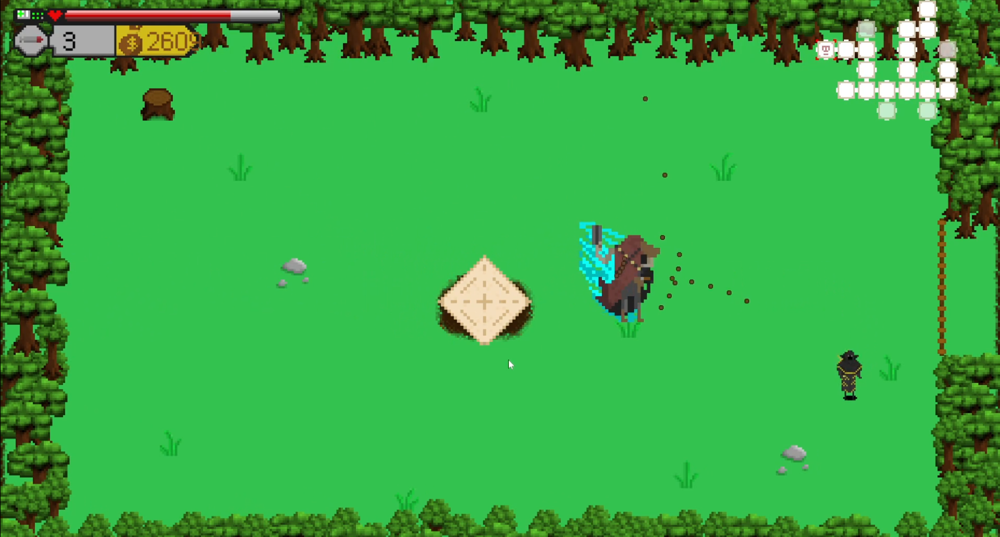

# Roguelike Shooter

This is a java based roguelike shooter built with a custom engine and assets. The goal is to find the boss of each stage to proceed to the next, each room will contain a set of monsters to kill before you can progress to the next. Supply crates will randomly spawn while you do not have an active weapon that will give you a weapon with limited ammo that is significantly more powerful than your default pistol.
You can dash with space to move much faster briefly, repeating a dash with the correct interval will allow you to chain dashes as long as you can keep up the chain. You also start with 6 med packs which will heal you by pressing Q and can pick more up from the ground. Occasionally enemies may drop pills, green pills grant maximum life and red pills grant increased damage for the rest of the run.

Controls:
- WASD for movement
- Aim with mouse
- Left Mouse to fire
- Space to dash
- Q to use a med pack
- R to drop weapon

